<div align="center">

# open-silong

**Open-source, self-hostable collaborative workspace — inspired by Notion & Obsidian.**

[](./LICENSE)
[](https://nextjs.org)
[](https://react.dev)
[](https://convex.dev)
[](https://tailwindcss.com)
[](./CONTRIBUTING.md)

[Live demo](https://silong-os.vercel.app) ·
[Docs](./docs/) ·
[Contributing](./CONTRIBUTING.md) ·
[Security](./SECURITY.md)

</div>

---

A block-based workspace for notes, docs, and lightweight databases,
with an Obsidian-style knowledge graph on top. Built for teams that
want to **own their data**: self-host the full stack with Docker
Compose, or run on Convex Cloud free tier. MIT licensed. No vendor
lock-in.

> **Inspired by [Notion](https://notion.so) & [Obsidian](https://obsidian.md).**
> open-silong is an independent, clean-room project — not affiliated with,
> endorsed by, or connected to Notion Labs, Inc. or Dynalist Inc. It borrows
> *ideas* (the block editor, the knowledge graph), never code or brand assets.
> See [`TRADEMARKS.md`](./TRADEMARKS.md).

## Screenshots

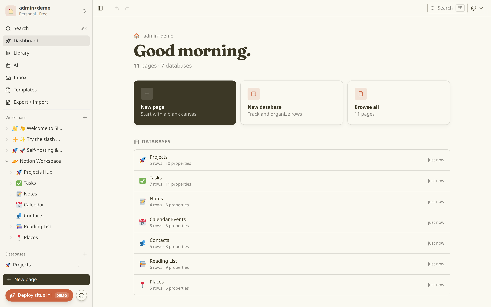

| Block editor | Database — Table | Database — Board |
|:---:|:---:|:---:|
| 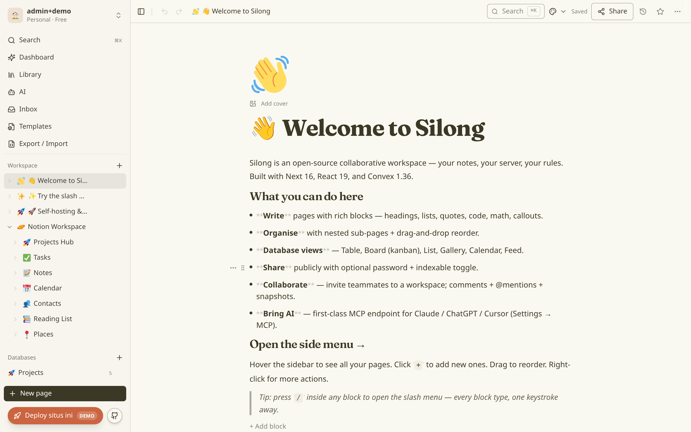 | 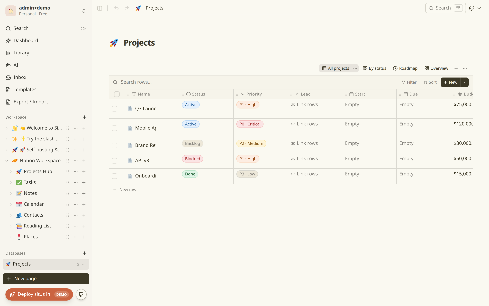 | 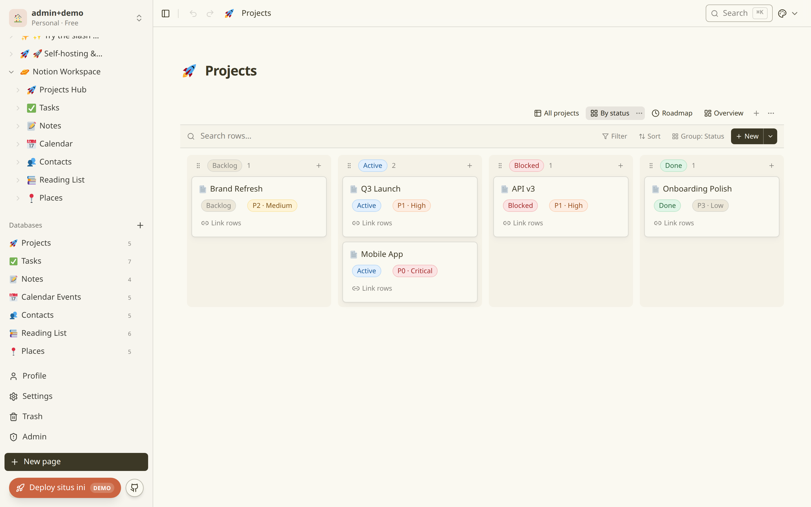 |
| **Template gallery** | **Admin panel** | **Command palette** |
| 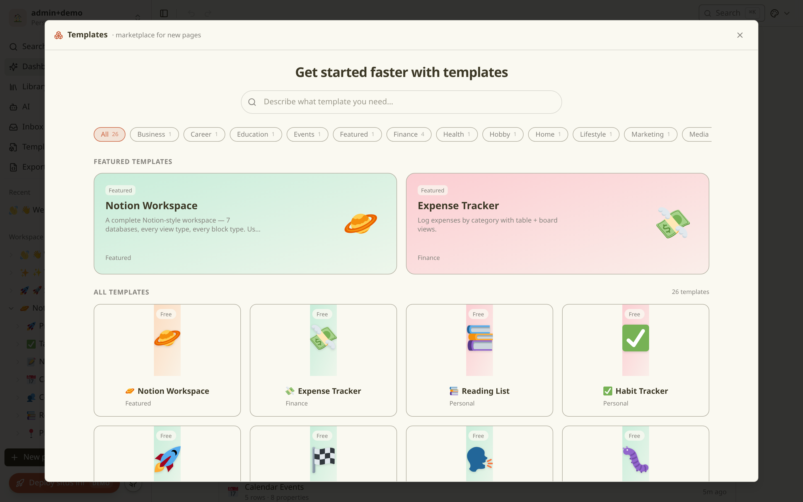 | 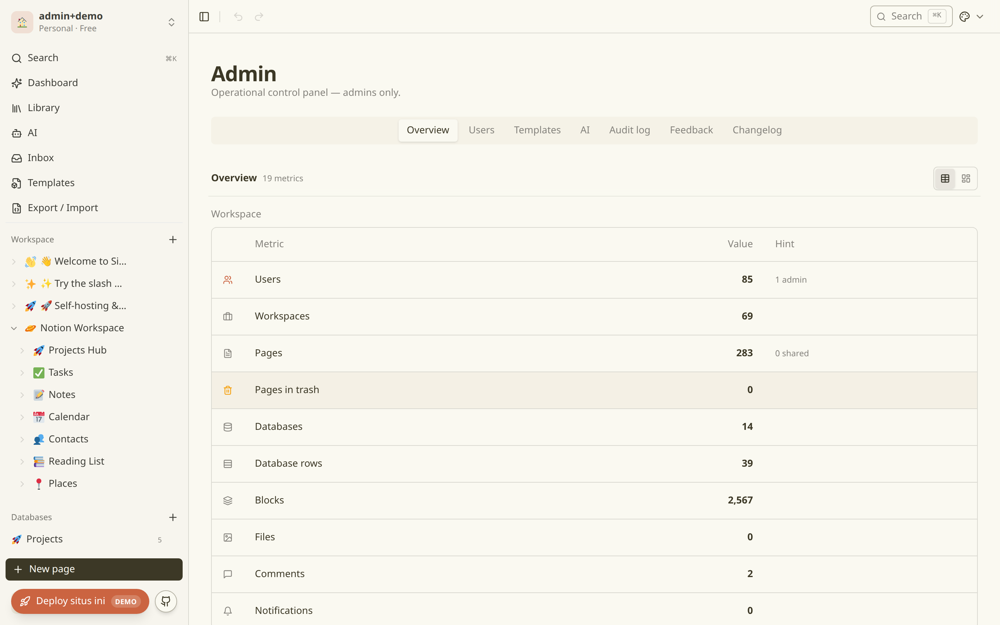 | 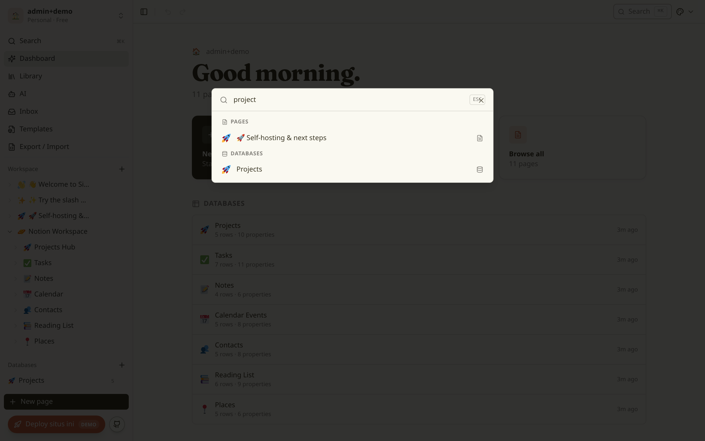 |

| Dark mode | Mobile | First-run setup |
|:---:|:---:|:---:|
| 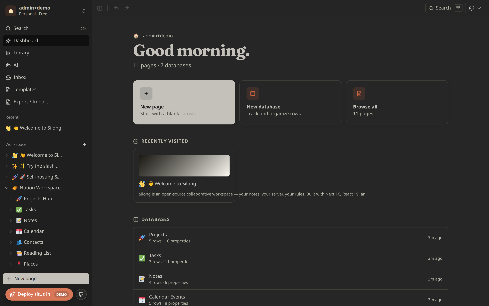 | 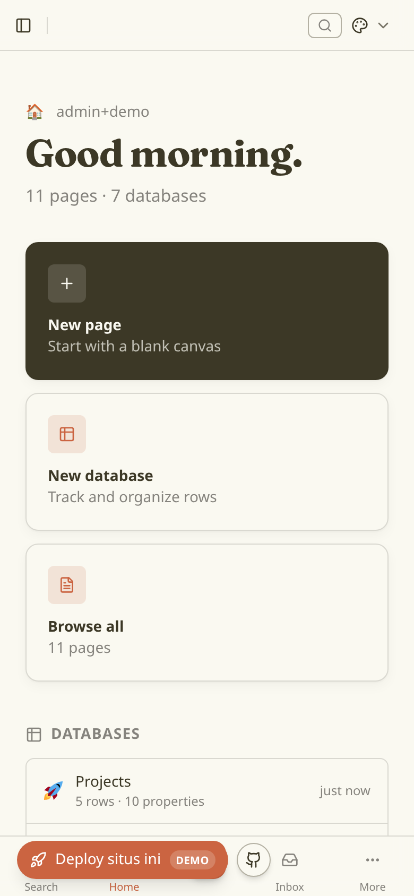 | 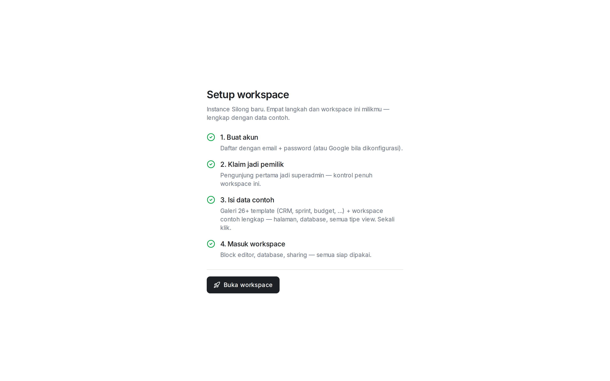 |

> Captured live on [silong-os.vercel.app](https://silong-os.vercel.app),
> signed in as the workspace superadmin (demo workspace seeded from the
> `/setup` wizard).

## Features

- **Block editor.** Slash-menu, drag-handle reorder, nested children,
  inline markdown decorator (bold/italic/strike/code/links), cover
  image, 30+ block types (paragraph, headings, todo, bullet/numbered
  lists, toggle, callout, quote, code, equation, table, image,
  video, embed, columns, divider, synced, …).
- **Databases.** Six views (Table · Board · List · Gallery · Calendar
  · Feed). Filter, sort, search, group, hide. Ten property types.
  Inline embed in any page OR open as full page.
- **Knowledge graph.** Obsidian-style interactive graph of every page,
  `[[wikilink]]`, `@mention`, `#tag`, and database row — with backlinks
  and unresolved "ghost" nodes. Live d3-force layout with tunable
  forces, cluster tinting, and focus/neighbourhood highlighting.
- **Multi-workspace.** Per-user workspaces, member roles, invites.
  Workspace switcher in sidebar.
- **Sharing.** Public read-only share links (optional password +
  expiry). Wiki mode. Per-page grants.
- **Collaboration.** Threaded comments per block, `@page` mentions,
  presence indicators, version snapshots.
- **Import / export.** JSON round-trip preserves blocks + databases
  + sharing state. Markdown export per page. ZIP bundle export.
- **MCP-ready.** First-class Notion-canonical JSON HTTP surface for
  AI agents and integrations (`/mcp/v1`).
- **Self-host friendly.** Docker Compose template for Convex backend +
  Postgres. Traefik-frontable. Dokploy-tested.

## Quick start (pick a lane)

### Lane 1 — Convex Cloud (fastest, free tier)

**One-click**: [Deploy with Vercel](https://vercel.com/new/clone?repository-url=https://github.com/rahmanef63/open-silong&env=CONVEX_DEPLOY_KEY&envDescription=Convex%20production%20deploy%20key%20%E2%80%94%20Convex%20dashboard%20%E2%86%92%20Settings%20%E2%86%92%20Deploy%20Keys&envLink=https%3A%2F%2Fdashboard.convex.dev) —
only asks for `CONVEX_DEPLOY_KEY` (create a project at
[dashboard.convex.dev](https://dashboard.convex.dev) → Settings → Deploy
Keys). The build deploys the Convex functions, provisions the auth keys,
and injects `NEXT_PUBLIC_CONVEX_URL` automatically. Your first visit
lands on the `/setup` wizard: claim the owner (superadmin) account and
seed the template gallery + demo workspace in one click.

Local development:

```bash
git clone https://github.com/rahmanef63/open-silong.git
cd open-silong
pnpm install
cp .env.example .env.local        # fill NEXT_PUBLIC_CONVEX_URL after step 4
npx convex dev                    # creates Convex Cloud project, prints URL
pnpm dev                          # http://localhost:3000
```

Convex Cloud free tier covers small teams. Full walk-through in
[`DEPLOY.md`](./DEPLOY.md#lane-1--convex-cloud).

### Lane 2 — Self-hosted (Docker Compose, full control)

```bash
git clone https://github.com/rahmanef63/open-silong.git
cd open-silong
cp .env.example .env.local        # fill INSTANCE_*, JWT_*, POSTGRES_URL
docker compose up -d              # Convex backend on port 3210
pnpm install
pnpm exec convex deploy --yes     # push schema + functions
pnpm dev                          # http://localhost:3000
```

Full Dokploy + Traefik + Postgres + S3 setup in
[`DEPLOY.md`](./DEPLOY.md#lane-2--self-hosted-docker-compose).

### Google OAuth sign-in (any lane)

`convex/auth.ts` already wires Google — just provide credentials:

```bash
# 1. Google Cloud Console → APIs & Services → Credentials → Create OAuth 2.0
#    client (Web app). Authorized redirect URI:
#    https://<your-CONVEX_SITE_ORIGIN>/api/auth/callback/google
# 2. Set on Convex backend
pnpm exec convex env set AUTH_GOOGLE_ID <client-id>.apps.googleusercontent.com
pnpm exec convex env set AUTH_GOOGLE_SECRET <client-secret>
```

The "Sign in with Google" button in `/auth` activates automatically
once those two env vars are set. Step-by-step including consent screen
setup + adding GitHub/Apple/Discord providers:
[`DEPLOY.md#google-oauth-sign-in-optional`](./DEPLOY.md#google-oauth-sign-in-optional).

### Lane 3 — Try without installing

[silong-os.vercel.app](https://silong-os.vercel.app) — public demo.
Lands you straight in a guest workspace (no sign-up needed), or create
an email + password account to keep your data. Instance is shared.

### Lane 4 — Template only (no backend)

Looking for the UI as a localStorage-only starter? The same editor
ships as `notion-page-clone-os` in the
[rahman-resources](https://github.com/rahmanef63/resources) template
marketplace:

```bash
npx rahman-resources@latest add notion-page-clone-os
```

## Stack

| Layer | Choice | Why |
|---|---|---|
| Frontend | Next 16 (App Router) + React 19 | RSC, streaming, file-based routing |
| Styling | Tailwind v4 + shadcn/ui | Theme tokens, primitives, dark mode |
| Backend | Convex 1.36 (self-hostable) | Realtime, optimistic, typed end-to-end |
| Auth | `@convex-dev/auth` | Magic-link, OAuth-ready, no Clerk |
| Storage | Convex file storage OR S3 adapter | Pluggable per slice |
| Search | Convex full-text index | No external search service |
| Deploy | Docker Compose + Traefik (self-host) OR Convex Cloud | Pick your trade-off |

## Architecture

A one-screen system view. The full set — data model, auth/authz flow, slice
graph, and the memory-graph pipeline — lives in
[`docs/architecture/diagrams.md`](./docs/architecture/diagrams.md).

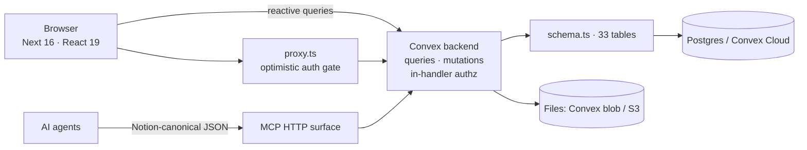

Repository layout:

```
app/                  Next 16 App Router routes
  dashboard/*         Authenticated surfaces (pages, db, settings, …)
  share/[id]          Public read-only share surface
  preview/*           Marketing + sandbox

frontend/
  slices/<name>/      Vertical feature slices — see docs/api/slices.md
  shared/             Cross-slice primitives, providers, store hooks
proxy.ts              Convex auth optimistic gate (not the security boundary)

convex/
  features/<name>/    Per-feature backend (schema + queries + mutations)
  _shared/            Auth helpers, rate limit, workspace gates
  http.ts             Public HTTP routes (share, MCP)
  mcp/                MCP HTTP surface (Notion-canonical JSON)

docker-compose.yml    Convex self-hosted (port 3210, Traefik-frontable)
```

The codebase follows a **slice architecture**: each feature lives in
`frontend/slices/<name>/` with optional `convex/features/<name>/`
mirror. Cross-slice imports go **through the barrel only**. See
[`CONTRIBUTING.md`](./CONTRIBUTING.md#slice-contract) for the rules.

## Documentation

| Topic | Where |
|---|---|
| Per-slice API + UX docs | [`docs/api/`](./docs/api/) |
| Architecture diagrams (system · data model · flows) | [`docs/architecture/diagrams.md`](./docs/architecture/diagrams.md) |
| Deploy walkthroughs (cloud + self-host + Dokploy) | [`DEPLOY.md`](./DEPLOY.md) |
| Slice catalog (every feature in one page) | [`docs/api/slices.md`](./docs/api/slices.md) |
| Architecture decisions + audit notes | [`docs/audit/`](./docs/audit/) |
| Contributing guide | [`CONTRIBUTING.md`](./CONTRIBUTING.md) |
| Security policy | [`SECURITY.md`](./SECURITY.md) |
| Code of Conduct | [`CODE_OF_CONDUCT.md`](./CODE_OF_CONDUCT.md) |
| Trademarks + inspiration + legal notes | [`TRADEMARKS.md`](./TRADEMARKS.md) |
| Changelog | [`CHANGELOG.md`](./CHANGELOG.md) |

## Roadmap

- [x] Block editor + 6 database views
- [x] Multi-workspace + invites
- [x] Public share links + wiki mode
- [x] Comments + mentions + snapshots
- [x] JSON import/export
- [x] MCP HTTP surface
- [ ] OAuth providers (Google, GitHub)
- [ ] Real-time multiplayer cursors
- [ ] PWA + offline mode

See [`docs/notion-clone/ROADMAP.md`](./docs/notion-clone/ROADMAP.md)
for the full backlog.

## Contributing

Bug reports, feature ideas, doc fixes, and code PRs are all welcome.
Read [`CONTRIBUTING.md`](./CONTRIBUTING.md) for dev setup, slice
architecture, and PR conventions.

By participating, you agree to the
[Code of Conduct](./CODE_OF_CONDUCT.md).

## Security

Found a vulnerability? Please **don't** open a public issue. Email
**security@rahmanef.com** or use a private GitHub Security Advisory —
see [`SECURITY.md`](./SECURITY.md) for SLAs and scope.

## License

[MIT](./LICENSE) © 2026 Rahman Effendi and open-silong contributors.

---

### Trademark + inspiration notice

`open-silong` is an **independent open-source project**. It is **not
affiliated with, sponsored by, endorsed by, or associated with Notion
Labs, Inc. or Dynalist Inc.** (the maker of Obsidian) in any way.

It is **inspired by** [Notion](https://notion.so) (the block editor +
lightweight databases) and [Obsidian](https://obsidian.md) (the
local-first knowledge graph). "Notion" and "Obsidian" are trademarks of
their respective owners, used here only in a **nominative / descriptive
sense** to identify familiar UI patterns — analogous to how an "iPhone
case" advertises compatibility without claiming any link to Apple.

open-silong is a **clean-room implementation** built independently on
[Convex](https://convex.dev), [Next.js](https://nextjs.org),
[shadcn/ui](https://ui.shadcn.com), and the open-source
[d3-force](https://d3js.org/d3-force) layout. **No proprietary Notion or
Obsidian code, design files, brand assets, or trade secrets are used.**
Import/export adapters target documented public file formats purely for
**interoperability**.

A full plain-language explanation — the idea/expression distinction,
nominative fair use, and international (EU/CJEU) anchors — is in
[**`TRADEMARKS.md`**](./TRADEMARKS.md). If you represent a rights holder
and have a good-faith concern, reach us via the email in
[`SECURITY.md`](./SECURITY.md) — we will adjust naming, disclaimers, or
surfaces in good faith.

> This notice is **not legal advice**; consult a qualified attorney for
> guidance specific to your jurisdiction and use.
