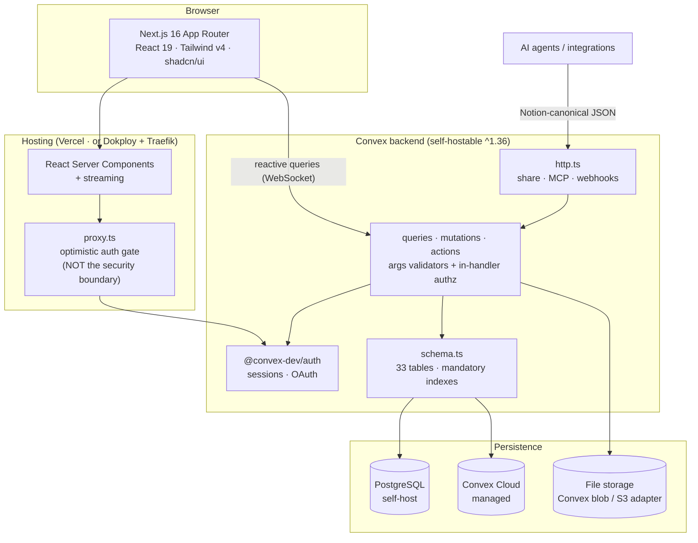
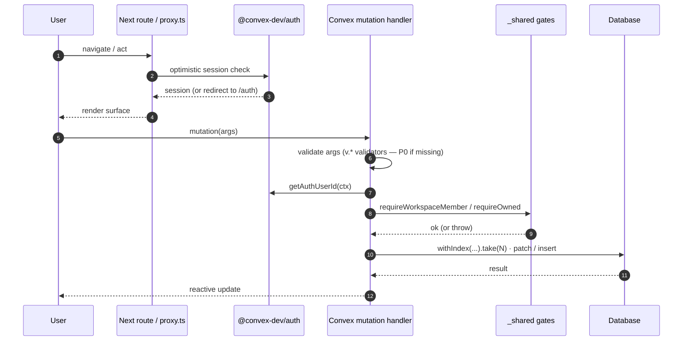
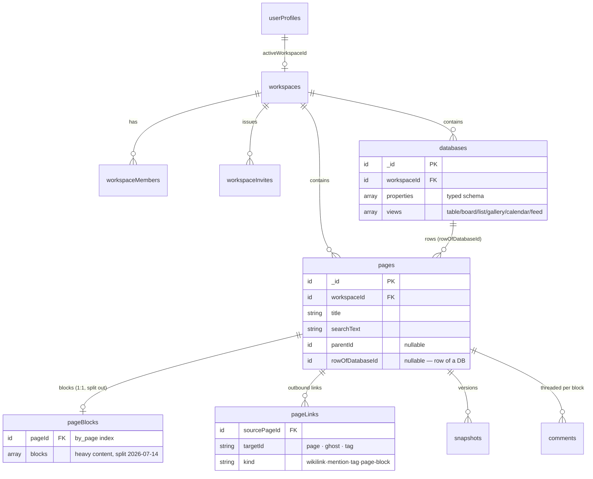
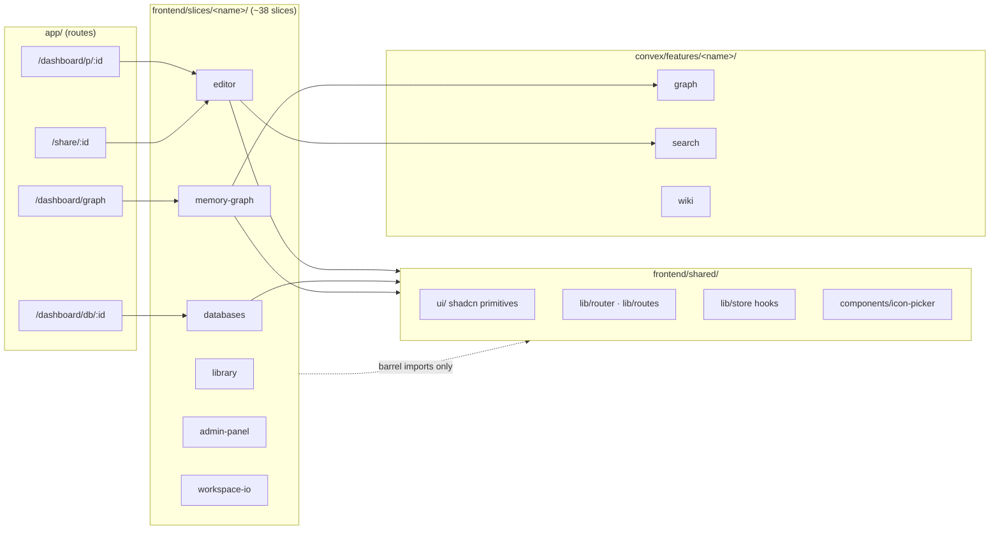
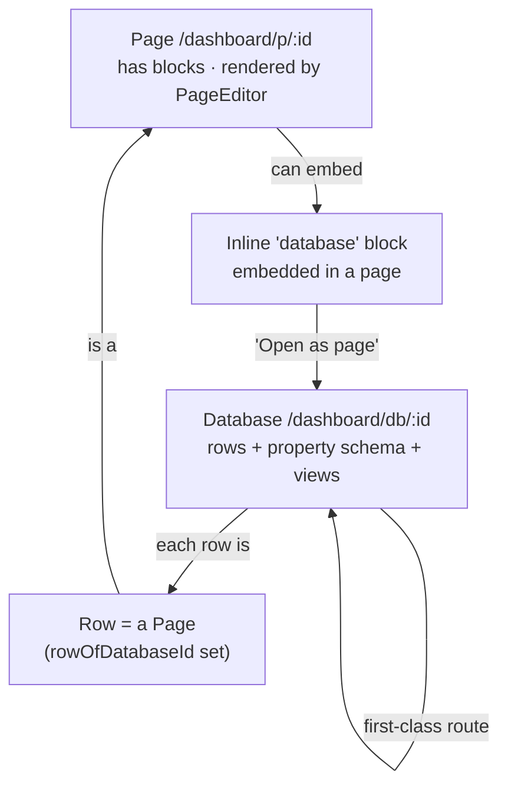
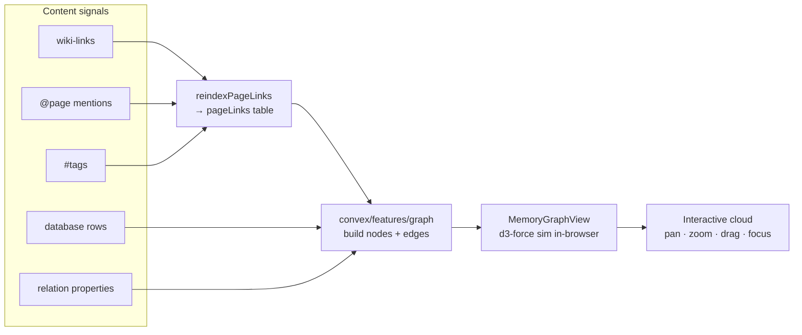

# open-silong — architecture diagrams

Living, source-controlled diagrams. All rendered with
[Mermaid](https://mermaid.js.org/), which GitHub renders inline — no image
hosting, no build step, diffs stay reviewable. Regenerate mentally: edit the
fenced ` ```mermaid ` blocks.

- [1. System architecture](#1-system-architecture)
- [2. Request & authorization flow](#2-request--authorization-flow)
- [3. Data model (core tables)](#3-data-model-core-tables)
- [4. Slice architecture](#4-slice-architecture)
- [5. Pages vs. databases](#5-pages-vs-databases)
- [6. Memory graph pipeline](#6-memory-graph-pipeline)

---

## 1. System architecture

How a request travels from the browser to storage, across both deployment
lanes (Convex Cloud and self-hosted Docker Compose).



> **Security note.** `proxy.ts` is an *optimistic* gate for UX only. Every
> `query` / `mutation` re-checks authorization **inside the handler**
> (`requireOwned` / `requireWorkspaceMember`). Route gates never protect the
> HTTP surface.

---

## 2. Request & authorization flow

The path of an authenticated write, showing where the real trust boundary sits.



---

## 3. Data model (core tables)

The workspace-scoped content graph. Auth, OAuth, AI-usage, webhook, and audit
tables (33 total) are omitted here for clarity — see `convex/schema.ts`.



---

## 4. Slice architecture

Vertical feature slices. Cross-slice imports go **through the barrel only**
(`@/features/<slug>`) — the barrel is the contract.



---

## 5. Pages vs. databases

Two first-class routable entities. A database **row is a page**; a database can
be **embedded** in a page's block stream or **opened as its own page**.



---

## 6. Memory graph pipeline

The Obsidian-style graph at `/dashboard/graph` is derived, not stored: links
are harvested from content, assembled into a graph, then laid out with a
d3-force simulation in the browser.



The force model mirrors [d3-force](https://d3js.org/d3-force) (which is what
Obsidian's graph is built on): inverse-square many-body repulsion, degree-
normalised link springs with a bias, and `forceX/Y` centre gravity. See
[`docs/memory-graph/`](../memory-graph/).
